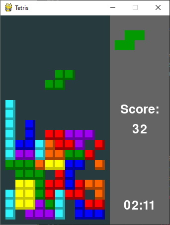

# Tetris Python Recreation
**Description:** This code is a recreation of the classic tetris game. This game was not originally designed by me, however. I did program this pygame version.

## Keys:
- Up: this key will rotate the current falling shape by 90 degrees.
- Left: this key will move the cube left.
- Right: this key will move the cube right.
- Down: this key will drop the cube faster.
- R: this key will start a new Tetris game.

## Extra Information:
**Modify the code:** Use the [Trinket](https://trinket.io/pygame/50c3ebf4af) service to edit and remix the code live in the browser *(without setting up pygame)*

>*Set up Pygame to run the code locally:* [Add Pygame](https://stackoverflow.com/questions/28453854/add-pygame-module-in-pycharm-id)

*Note:* This program was started on 3/4/2020, and finished on 4/26/2020 6:37 PM.

*To be added:* Add a highlighter at the lowest possible spot for that shape.
